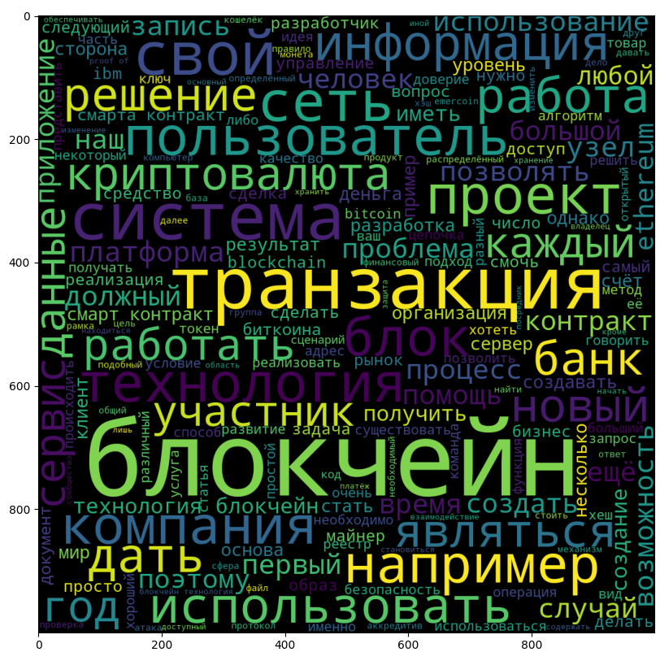

# habr_parser
ITMO magester's class lab

## to_do
- Parse habr.com search pages
- save data in a format of {"title": title, "link": link}
- Text processing (find key topics and definitions(I've used tags), find key trendsetters from the text, and make word cloud based on article's text)

## Results:
- collected 48 repeated tags
- collected 48 repeated "trendsetter" - some of them are key definitions actually

Word cloud for blockchain related articles:

